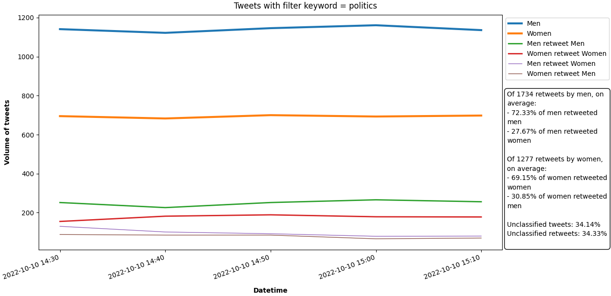
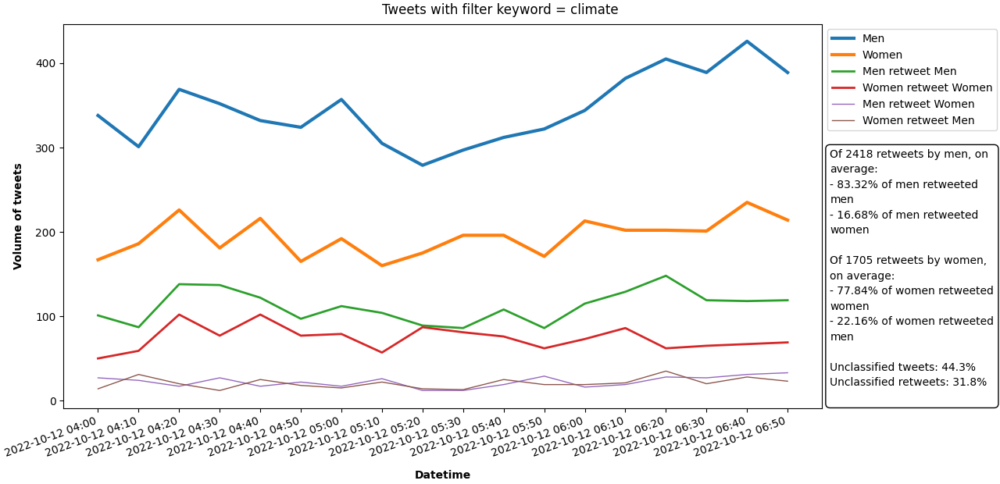

# MSE231_F22 ASSIGNMENT 1 - TWEET ANALYSIS 

## SPECIFICATIONS
- https://mse231.github.io/assignment1.html
- https://github.com/mse231/mse231_f22

### REFERENCES
- personal Twitter developer portal: https://developer.twitter.com/en/portal/projects/1578992483542761473/apps
- Tweet object api: https://developer.twitter.com/en/docs/twitter-api/data-dictionary/object-model/tweet
- plt text api: https://matplotlib.org/stable/api/_as_gen/matplotlib.pyplot.text.html
- plt legend api: https://matplotlib.org/stable/api/_as_gen/matplotlib.pyplot.legend.html

#### TWEET ANALYSIS
- https://twitter.com/i/web/status/<tweet_id>
- sample retweet [object](archives/retweet_sample.jsonc) corresponds to [this tweet](https://twitter.com/i/web/status/1579477321878482944)

## PROJECT STRUCTURE
- `creds.txt` file containing all user keys needed to use Twitter's API <b>(DO NOT MODIFY)</b>
  - <i>file is excluded from github repo</i>
- `tweet_stream.py` uses Twitter's streaming API and the Tweepy python wrapper to scrape real-time Tweets; includes various flags to specify output or to filter certain tweets (specified below in commands)
- `parse_tweets.py` reads a stream of raw tweets from stdin, processes them and saves the processed data to a (new) csv file specified by the user
- `tweet_analysis.py` reads from the processed csv file to predict users' (and original posters') genders, then plot a graph

### SUBFOLDERS
- `archives` contains some files used to visualise processed data
- `graphs` contains the graphs generated from `tweet_analysis.py`
- `ssa_names` contains the baby names data separated by gender from SSA; `.tsv` files are the unzipped original files while `.txt` files contain processed data

### TWEET COLLECTION LOG
- <i>record of each .gz file in the format: `filename.gz` (keyword) - date time duration</i>
- `netflix.gz` (netflix) - 09/10/22 1535 ~1min
- `inflation.gz` (inflation) - 09/10/22 1631-1748 ~1h17min
- `tweets0.gz` (NIL) - 10/10/22 1002-1044 ~42min
- `space.gz` (space) - 10/10/22 1049 ~50s
- `politics.gz` (politics) - 10/10/22 2222-2325 ~1h3min
- `climate.gz` (climate) - 12/10/22 1159-1501 ~3h1min

## COMMANDS
1. `python tweet_stream.py --keyfile creds.txt --gzip KEYWORD.gz --filter KEYWORD`
   - sample 1% of real-time tweets using the provided credentials (until Ctrl-C is entered)
   - gzip the output to the given file
   - filters only the tweets containing the given keyword(s)
2. `7z e -so KEYWORD.gz | python parse_tweets.py KEYWORD.csv`
   - pipe each Tweet object into stdin for python file, and output processed tweet data to given csv file
   - `7z e -so KEYWORD.gz` extract .gz file using 7zip and print to stdout
3. `python tweet_analysis.py KEYWORD.csv`
   - uses the processed csv data to predict users' (and original posters') genders
   - plots multiple lines of tweet volume against time using predicted genders

## GRAPHS

> Note that trends observed may not accurately reflect real world tweet volume, as the graph excludes the tweets of users whose gender we are unable to classify

## ANALYSIS

### GENDER PREDICTION
- from `parse_tweets.py`, users' usernames are processed, where non-alphabetic characters are removed and the most probable first name is added to the csv file
- in `tweet_analysis.py`, first names are classified based on their frequency in the SSA datasets
- names that cannot be classified are not reflected in the graphs (~30-45% of tweets)

### ISSUES
- when fetching tweets without a --filter keyword, tweet object returned is truncated (eg. tweets0.gz), but it does not count as a pulled tweet in the portal - how to fetch random sample?

## CHANGELOG
- 08/10/22
  - read, understand assignment specifications
- 09/10/22
  - 1415-1430 install tweepy (global)
  - 1430-1515 setup twitter developer's account, create project/app, clone github repo
  - 1515-1530 test twitter api using `tweet_stream.py`
  - 1530-1600 install 7zip, pipe .gz tweet data into stdout
  - 1600-1630 initialise readme file
  - 1740-1850 `parse_tweets.py` read json object from stdin
  - 2200-0000 completed `parse_tweets.py` get most distinctive first name, save to csv file
  - 0000-0130 `tweet_analysis.py` try processing male/female .gz files - encoding errors (failed)
- 10/10/22
  - 1000-1100 `tweet_analysis.py` process male/female .gz files; fetch more twitter data
  - 1900-1930 `tweet_analysis.py` predict genders from user's names
  - 2030-2230 `tweet_analysis.py` save tweets with genders, plot basic graph of total volume against time
  - 0130 `parse_tweets.py` added error handling in - occasional errors in retrieving data field
- 11/10/22
  - 0830-0915 `tweet_analysis.py` graphs for retweeted tweets per gender
  - 1130-1205 `tweet_analysis.py` convert retweet data to numpy arrays, calculate mrm/frf percentages
  - 1400-1600 `tweet_analysis.py` try to add levenshtein distance (failed)
- 12/10/22
  - 1200-1245 refactor `tweet_analysis.py`; fetch twitter data
  - 1500-1730 `tweet_analysis.py` improve graph appearance (prevent axis overlaps, legend, write texts)
  - 1800-2000 readme file, `tweet_analysis.py` modify error with frm/frf, add unclassified percentages, push to github
